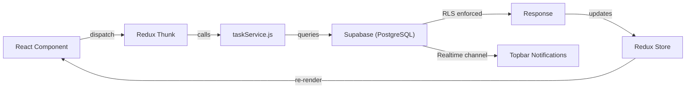
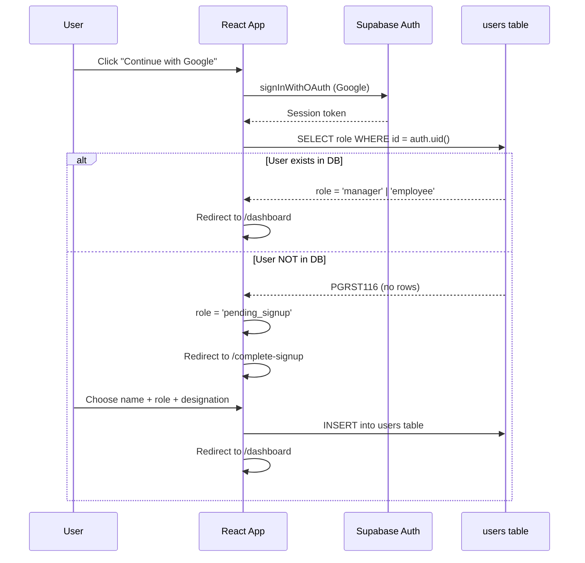
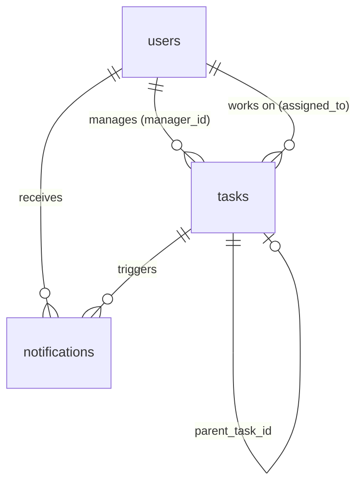
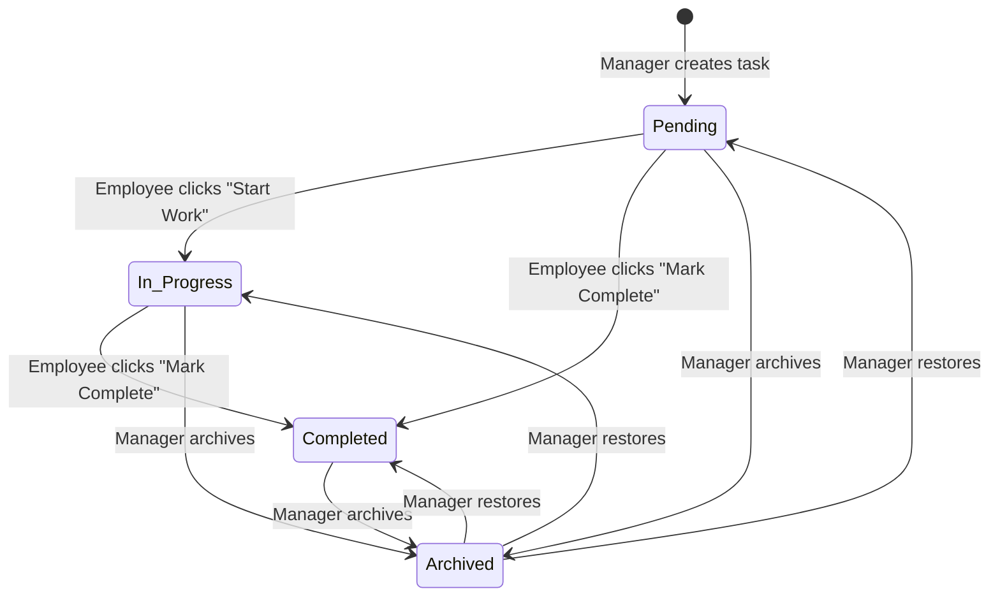
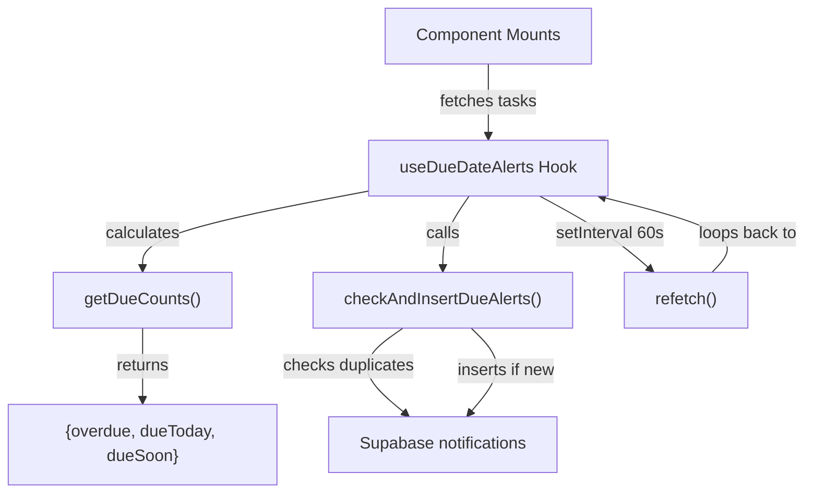
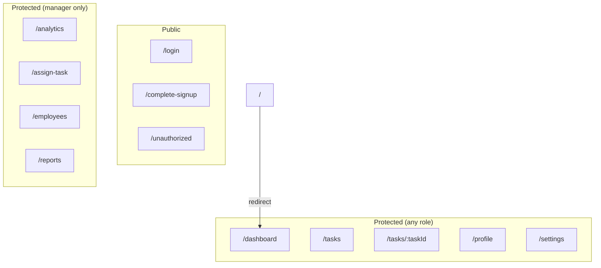

# ReliabilityIQ — Project Documentation

> **Smart Task & Reliability Management Platform**
> Version 0.0.0 · Built with React 19 + Supabase · Feb 2026

---

## Table of Contents

1. [Project Overview](#1-project-overview)
2. [Architecture Explanation](#2-architecture-explanation)
3. [Tech Stack & Libraries](#3-tech-stack--libraries)
4. [Role-Based Access Model](#4-role-based-access-model)
5. [Database Schema](#5-database-schema)
6. [RLS Security Implementation](#6-rls-security-implementation)
7. [Task Lifecycle Model](#7-task-lifecycle-model)
8. [Team Hierarchy Logic](#8-team-hierarchy-logic)
9. [Automatic Due-Date Alert System](#9-automatic-due-date-alert-system)
10. [Profile & Storage Integration](#10-profile--storage-integration)
11. [State Management (Redux)](#11-state-management-redux)
12. [Routing & Protected Routes](#12-routing--protected-routes)
13. [Future Scalability Improvements](#13-future-scalability-improvements)

---

## 1. Project Overview

**ReliabilityIQ** is a team productivity and accountability platform designed to help managers track employee task performance through a quantified **Reliability Score** — a metric representing each team member's on-time task completion rate.

### Core Value Proposition

| Problem | Solution |
|---|---|
| Managers lack visibility into task completion trends | Real-time dashboard with per-employee reliability scores |
| Overdue tasks go unnoticed | Automatic due-date alerts with 60s polling |
| No accountability metric exists | Reliability Score = (On-Time Completions / Total Assigned) × 100 |
| Task deletion loses audit trail | Soft archive system — no permanent delete |

### Key Features

- **Role-based dashboards** — Separate Manager and Employee views
- **Reliability scoring** — Quantified on-time completion rate per employee
- **Automatic due-date alerts** — Overdue / Due Today / Due Soon detection
- **Real-time notifications** — Bell icon with Supabase Realtime subscriptions
- **Task lifecycle management** — Create → Assign → Track → Complete → Archive
- **Team analytics** — Charts, trends, and performance distribution
- **Dark mode** — Full application-wide theme support

---

## 2. Architecture Explanation

ReliabilityIQ follows a **feature-based architecture** where code is organized by business domain rather than file type.

### Directory Structure

```
src/
├── App.jsx                    # Root component (Provider wiring)
├── AppRoutes.jsx              # Centralized routing definitions
├── main.jsx                   # Entry point (React DOM render)
│
├── lib/
│   └── supabase.js            # Supabase client initialization
│
├── store/
│   ├── store.js               # Redux store configuration
│   └── themeSlice.js          # Dark/light theme state
│
├── features/                  # Business domain modules
│   ├── auth/                  # AuthContext, Login, Signup, Unauthorized
│   ├── dashboard/             # Manager & Employee dashboards + components
│   ├── tasks/                 # TasksDashboard, tasksSlice (Redux)
│   ├── notifications/         # notificationsSlice (Redux)
│   └── analytics/             # TeamAnalytics (charts & trends)
│
├── pages/                     # Route-level page components
│   ├── auth/                  # Login, CompleteSignup
│   ├── manager/               # AssignTask, Employees, Reports
│   ├── employee/              # MyTasks
│   └── shared/                # TaskDetails, Profile, Settings, NotFound
│
├── components/                # Shared, reusable components
│   ├── layout/                # Layout, Sidebar, Topbar
│   ├── ui/                    # StatCard, Card, Badge, Spinner, ConfirmModal, etc.
│   ├── ProtectedRoute.jsx     # Route guard component
│   └── ErrorBoundary.jsx      # Global error boundary
│
├── hooks/
│   └── useDueDateAlerts.js    # Due date alert hook (polling + notifications)
│
├── services/
│   └── taskService.js         # All Supabase CRUD operations
│
└── utils/
    └── dueDateUtils.js        # Pure date classification functions
```

### Data Flow



---

## 3. Tech Stack & Libraries

### Core

| Technology | Version | Purpose |
|---|---|---|
| **React** | 19.2.0 | UI library (functional components + hooks) |
| **Vite** | 7.3.1 | Build tool & dev server (HMR) |
| **Tailwind CSS** | 4.2.1 | Utility-first CSS framework |
| **Supabase** | 2.97.0 | Backend-as-a-Service (Auth, DB, Realtime, Storage) |

### State & Routing

| Library | Version | Purpose |
|---|---|---|
| **Redux Toolkit** | 2.11.2 | Global state management |
| **React Redux** | 9.2.0 | React bindings for Redux |
| **React Router DOM** | 7.13.1 | Client-side routing |

### UI & Utilities

| Library | Version | Purpose |
|---|---|---|
| **Lucide React** | 0.575.0 | Icon library (tree-shakeable SVGs) |
| **Recharts** | 3.7.0 | Data visualization (charts) |
| **date-fns** | 4.1.0 | Date manipulation & comparison |
| **react-hot-toast** | 2.6.0 | Toast notification system |
| **LogRocket** | 12.0.0 | Session replay & error tracking |

### Development

| Tool | Version | Purpose |
|---|---|---|
| **ESLint** | 9.39.1 | Code linting |
| **PostCSS** | 8.5.6 | CSS processing pipeline |
| **Autoprefixer** | 10.4.24 | Vendor prefix automation |

---

## 4. Role-Based Access Model

ReliabilityIQ supports **two roles**: `manager` and `employee`. Role selection happens during onboarding, not registration.

### Authentication Flow



### Permission Matrix

| Feature | Manager | Employee |
|---|:---:|:---:|
| View Dashboard | ✅ Own team | ✅ Personal |
| Create Tasks | ✅ | ❌ |
| Assign Tasks | ✅ | ❌ |
| Update Task Status | ✅ All | ✅ Own only |
| Archive / Restore Tasks | ✅ | ❌ |
| View All Team Tasks | ✅ | ❌ |
| View Own Tasks | ✅ | ✅ |
| View Employees | ✅ | ❌ |
| View Analytics | ✅ | ❌ |
| View Reports | ✅ | ❌ |
| Edit Profile | ✅ | ✅ |
| Receive Notifications | ✅ | ✅ |

---

## 5. Database Schema

ReliabilityIQ uses **Supabase (PostgreSQL)** with three primary tables:

### `users` Table

| Column | Type | Description |
|---|---|---|
| `id` | UUID (PK) | Matches `auth.uid()` |
| `email` | TEXT | Google account email |
| `name` | TEXT | Display name |
| `role` | VARCHAR | `'manager'` or `'employee'` |
| `designation` | TEXT | Job title (employees only) |
| `manager_id` | UUID (FK) | References manager's user ID |
| `avatar_url` | TEXT | Profile picture URL (Supabase Storage) |
| `created_at` | TIMESTAMPTZ | Account creation timestamp |

### `tasks` Table

| Column | Type | Description |
|---|---|---|
| `id` | UUID (PK) | Auto-generated |
| `title` | TEXT | Task name |
| `description` | TEXT | Task details |
| `status` | VARCHAR | `'pending'` / `'in_progress'` / `'completed'` |
| `priority` | VARCHAR | `'low'` / `'medium'` / `'high'` |
| `due_date` | DATE | Task deadline |
| `assigned_to` | UUID (FK) | Employee user ID |
| `manager_id` | UUID (FK) | Creator/manager user ID |
| `parent_task_id` | UUID (FK) | Self-referencing for task chains |
| `remarks` | JSONB | Array of system logs and user discussions |
| `completed_at` | TIMESTAMPTZ | When task was marked complete |
| `is_archived` | BOOLEAN | Soft delete flag (default: `false`) |
| `created_at` | TIMESTAMPTZ | Task creation timestamp |

### `notifications` Table

| Column | Type | Description |
|---|---|---|
| `id` | UUID (PK) | Auto-generated |
| `user_id` | UUID (FK) | Recipient user ID |
| `task_id` | UUID (FK) | Related task (nullable) |
| `title` | TEXT | Notification heading |
| `message` | TEXT | Notification body |
| `type` | VARCHAR(50) | `'assigned'` / `'status_update'` / `'overdue'` / `'due_today'` / `'remark'` |
| `is_read` | BOOLEAN | Read status (default: `false`) |
| `created_at` | TIMESTAMPTZ | Insertion timestamp |

### Entity Relationships



---

## 6. RLS Security Implementation

All tables have **Row Level Security (RLS)** enabled. Supabase enforces these policies at the database level — the frontend can never bypass them.

### Tasks Table Policies

| Operation | Who | Condition |
|---|---|---|
| **SELECT** | Authenticated | `auth.uid() = assigned_to` OR `auth.uid() = manager_id` |
| **INSERT** | Managers only | `auth.uid() = manager_id` |
| **UPDATE** | Both roles | `auth.uid() = assigned_to` OR `auth.uid() = manager_id` |
| **DELETE** | Managers only | `auth.uid() = manager_id` |

### Column-Level Protection (Trigger)

Employees can update tasks but are restricted to **only** `status` and `completed_at` columns. A PostgreSQL trigger `enforce_task_employee_updates` fires on every `UPDATE` and raises an exception if a non-manager attempts to modify:

- `title`, `description`, `priority`, `due_date`, `assigned_to`, `manager_id`

```sql
-- Simplified trigger logic
IF auth.uid() != OLD.manager_id THEN
  IF NEW.title != OLD.title OR NEW.description != OLD.description OR ...
    RAISE EXCEPTION 'Employees are only allowed to update status and completed_at columns.';
  END IF;
END IF;
```

### Users Table Policies

| Operation | Who | Condition |
|---|---|---|
| **SELECT** | Authenticated | `true` (all profiles visible) |
| **INSERT** | Self only | `auth.uid() = id` |
| **UPDATE** | Self only | `auth.uid() = id` |

### Role Escalation Prevention (Trigger)

A `prevent_role_escalation` trigger blocks any UPDATE that changes the `role` column once set:

```sql
IF OLD.role IS NOT NULL AND NEW.role != OLD.role THEN
  RAISE EXCEPTION 'Role escalation is strictly prohibited from the client.';
END IF;
```

### Notifications Table Policies

| Operation | Who | Condition |
|---|---|---|
| **SELECT** | Self only | `auth.uid() = user_id` |
| **INSERT** | Authenticated | `true` (system can notify anyone) |
| **UPDATE** | Self only | `auth.uid() = user_id` |
| **DELETE** | Self only | `auth.uid() = user_id` |

---

## 7. Task Lifecycle Model



### Key Behaviors

| Action | Actor | Effect |
|---|---|---|
| **Create** | Manager | Inserts task with `status='pending'`, `manager_id` = creator |
| **Assign** | Manager | Sets `assigned_to` to employee UUID, triggers notification |
| **Start Work** | Employee | Sets `status='in_progress'` |
| **Mark Complete** | Employee/Manager | Sets `status='completed'`, `completed_at` = now |
| **Archive** | Manager | Sets `is_archived=true`, task hidden from active views |
| **Restore** | Manager | Sets `is_archived=false`, task reappears in active views |
| **Add Remark** | Both | Appends to `remarks` JSONB array |

> **No permanent delete exists.** The `deleteTask` method was removed and replaced with `archiveTask`.

---

## 8. Team Hierarchy Logic

ReliabilityIQ uses a **flat one-level hierarchy**: Manager → Employees.

### How It Works

1. **Manager creates an account** → role = `'manager'`
2. **Employee creates an account** → role = `'employee'`
3. **Manager assigns tasks** → `manager_id` on the task links it to the manager
4. **Visibility is scoped** — managers see tasks where `manager_id = auth.uid()`; employees see tasks where `assigned_to = auth.uid()`

### Manager Dashboard Metrics

The Manager Dashboard aggregates data across **all employees assigned by that manager**:

- **Total Employees** — Distinct `assigned_to` values across the manager's tasks
- **Total Assigned** — Count of all tasks with `manager_id = current user`
- **Completed Tasks** — Tasks with `status = 'completed'`
- **Overdue / Due Today / Due Soon** — Calculated by `useDueDateAlerts` hook
- **Overall Reliability** — Aggregate on-time completion rate across the team

### Employee Dashboard Metrics

- **Total Assigned** — Tasks where `assigned_to = current user`
- **Completed** — Tasks with `status = 'completed'`
- **Pending** — Tasks not yet completed
- **Overdue / Due Today** — Personal due-date status
- **My Reliability Score** — (On-time completions / Total assigned) × 100

---

## 9. Automatic Due-Date Alert System

The alert system is **fully automatic** — no manual trigger required.

### Architecture



### Classification Logic (`dueDateUtils.js`)

| Status | Condition |
|---|---|
| **Overdue** | `due_date < today` AND `status ≠ completed` |
| **Due Today** | `due_date = today` AND `status ≠ completed` |
| **Due Soon** | `due_date` is within 2 days (tomorrow or day after) |
| **null** | No due date, completed, or further than 2 days away |

### Duplicate Prevention

Before inserting a notification, the system queries:
```
SELECT id FROM notifications
WHERE task_id = ? AND user_id = ? AND type = ? AND created_at >= today
LIMIT 1
```

If a matching notification already exists **today**, the insert is skipped. This prevents the 60s polling from creating duplicate alerts.

### Alert Recipients

Both the **assignee** (`assigned_to`) and the **manager** (`manager_id`) receive notifications for overdue and due-today tasks.

---

## 10. Profile & Storage Integration

### Profile Management

Users can update their profile details through the **Settings** page:
- Display name
- Avatar image (uploaded to Supabase Storage)
- Designation (employees)

### Supabase Storage

- **Bucket**: `avatars` — for user profile pictures
- **RLS on storage**: Users can upload/update/delete only their own avatar
- **URL pattern**: `{SUPABASE_URL}/storage/v1/object/public/avatars/{user_id}`

### Storage RLS Policies

| Operation | Policy |
|---|---|
| **SELECT** | Public (anyone can view avatar URLs) |
| **INSERT** | `auth.uid()::text = (storage.foldername(name))[1]` |
| **UPDATE** | Same as INSERT |
| **DELETE** | Same as INSERT |

---

## 11. State Management (Redux)

ReliabilityIQ uses **Redux Toolkit** with three slices:

### Store Configuration

```
store/
├── store.js         # configureStore with serializable check disabled
└── themeSlice.js    # Dark/light mode toggle
```

### Slices

| Slice | State Shape | Async Thunks |
|---|---|---|
| **tasks** | `{ items: [], status, error }` | `fetchTasks`, `createTask`, `assignTask`, `updateTaskStatus` |
| **notifications** | `{ items: [], unreadCount, status }` | `fetchNotifications`, `markAsRead` |
| **theme** | `{ mode: 'light' \| 'dark' }` | None (synchronous) |

### Task Slice Features

- **Optimistic updates** — `updateTaskStatus.pending` immediately modifies the local state
- **Rollback on failure** — `updateTaskStatus.rejected` reverts to original status
- **Role-aware fetching** — `fetchTasks` calls `getAllTasks` for managers, `getAssignedTasks` for employees

### Data Flow Pattern

```
Component → dispatch(thunk) → taskService.method() → Supabase API
                                                         ↓
Component ← useSelector ← Redux Store ← fulfilled reducer
```

---

## 12. Routing & Protected Routes

### Route Architecture



### ProtectedRoute Component

The `ProtectedRoute` component acts as a route guard with three checks:

```
1. Not authenticated?     → Redirect to /login
2. Role = pending_signup? → Redirect to /complete-signup
3. Missing required role? → Redirect to /unauthorized
4. All checks pass?       → Render <Outlet />
```

### Dynamic Route Behavior

The `/tasks` route renders **different components** based on role:
- **Manager** → `TasksDashboard` (with Active/Archived tabs)
- **Employee** → `MyTasks` (personal task table with filters)

---

## 13. Future Scalability Improvements

### Short-Term

| Improvement | Impact |
|---|---|
| **Multi-level hierarchy** | Support team leads, department heads, and org-level views |
| **Task categories/tags** | Better organization and filtering |
| **Bulk task operations** | Archive, reassign, or update multiple tasks at once |
| **Export to CSV/PDF** | Download reports for offline analysis |
| **Email notifications** | Supabase Edge Functions for email alerts |

### Medium-Term

| Improvement | Impact |
|---|---|
| **Supabase Edge Functions** | Server-side alert processing instead of client-side polling |
| **Recurring tasks** | Auto-create tasks on a schedule (daily, weekly, monthly) |
| **Task templates** | Pre-defined task blueprints for common workflows |
| **Performance reviews** | Aggregate reliability scores into formal review periods |
| **Audit log table** | Track every state change with who/when/what metadata |

### Long-Term

| Improvement | Impact |
|---|---|
| **Multi-tenancy** | Organization-level isolation for SaaS deployment |
| **AI-powered insights** | Predict overdue tasks, recommend optimal assignments |
| **Mobile app** | React Native or PWA for on-the-go task management |
| **Webhook integrations** | Slack, Teams, Jira, and third-party tool connections |
| **SSO / SAML** | Enterprise single sign-on for corporate deployments |

### Performance Optimizations

| Area | Current | Improvement |
|---|---|---|
| **Alert processing** | Client-side (60s polling) | Server-side Edge Function (event-driven) |
| **Task fetching** | Full table scan with filters | Materialized views for dashboard aggregates |
| **Notifications** | Per-task duplicate check | Batch insert with `ON CONFLICT DO NOTHING` |
| **Profile images** | Direct Supabase Storage | CDN with image optimization (WebP, resizing) |

---

> **Document generated**: February 28, 2026
> **Project**: ReliabilityIQ v0.0.0
> **Stack**: React 19 · Supabase · Redux Toolkit · Tailwind CSS v4 · Vite 7
